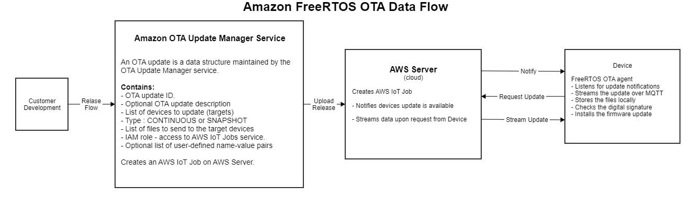
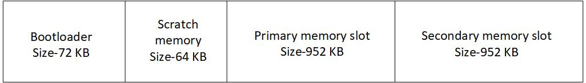
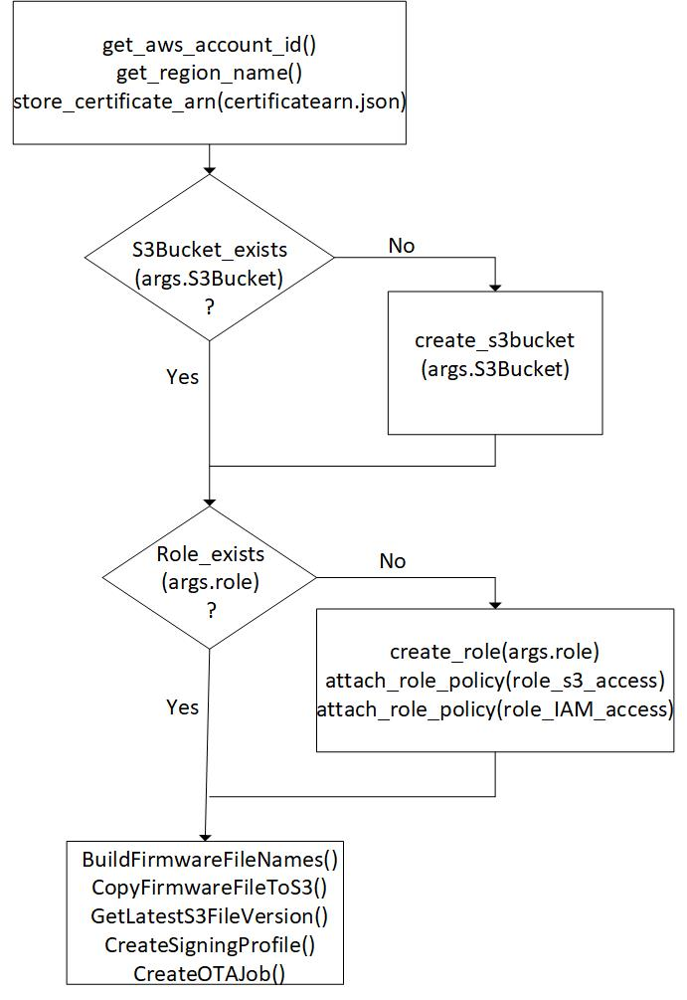

### Description

TBD

### Workspace preparation

#### Software

**awscli** - command line tool to interact with Amazon Web Services. It is a Python module. Installation of this tool would be covered in next paragraphs.

**Cypress Programmer** (optional) is a GUI programmer tool for flashing Cypress chips. Link to download - https://www.cypress.com/products/psoc-programming-solutions

**ModusToolBox IDE** is required to use this demo. It is cross platform and can be downloaded from official Cypress website - https://www.cypress.com/products/modustoolbox-software-environment

Installation includes following components in one package:

1. Eclipse based GUI
2. ARM Cortex M Cross Toolchain
3. OpenOCD programmer/debugger
4. Periphery configurators
5. Libraries and tools

There are couple ways of using `ModusToolbox IDE` for this demo:

1. Using ModusToolbox IDE - eclipse based full featured development environment
2. Use ModusToolbox IDE tools from command line

`amazon-freertos` also support **Cmake** build system. More info about using this build system can be found in Readme.md

In case of using **Cmake** - this build system should also be installed.

**Following text will rely on using ModusToolbox IDE tools from command line method.**

#### Hardware

Cypress PSoC 6 Wi-Fi BT Prototyping Kit [**CY8CPROTO-062-4343W**](https://www.cypress.com/documentation/development-kitsboards/psoc-6-wi-fi-bt-prototyping-kit-cy8cproto-062-4343w) will be used for this demo. 

*NOTE:* This kit ship with KitProg2 installed. ModusToolbox software requires KitProg3. Before using this demo, make sure that the kit is upgraded to KitProg3. The tool and instructions are available in the Firmware Loader [GitHub repository](https://github.com/cypresssemiconductorco/Firmware-loader/releases/tag/3.0.0). If you do not upgrade, you will see an error like “unable to find CMSIS-DAP device” or “KitProg firmware is out of date”.

To update firmware of kitprog execure following commands:

1. `cd fw-loader/bin`
2. `./fw-loader --device-list` – Displays the list of connected devices.
3. `./fw-loader --update-kp3 [device-name]` – Update the firmware of the specified device to KitProg3.

#### Code repositories

This guide is distributed in scope of https://github.com/romanjoe/secure_ota_update_workshop repository. There is a folder called `sandbox` in this repo. It contains `mcuboot` and `amazon-freertos` code repositories, as `git submodules`. Correct repositories tags are alredy set by submodules config in this repo:

`mcuboot`: repo https://github.com/JuulLabs-OSS/mcuboot tag `v1.5.0-cypress`
`amazon-freertos`: repo https://github.com/cypresssemiconductorco/amazon-freertos.git tag: `201910-MTBAFR1951`

Be aware, that these two repositoires have its own submodules. To ensure everything is checked out run this command:

    git submodule update --init --recursive

**ATTENTION:** this demo is only guarantee to work, using code from mentioned tags. Following updates of `mcuboot` or `amazon-freertos` may break this example due to compatibility issues.

#### Amazon Web Services preparation 

**1. Create and configure AWS User Profile**

Create Amazon Web Services account. You will be asked to ented your bank card number, but it will now charge you.

Fill all required fields and sing in to created account.

**3. Install `awscli` - command line tool to work with AWS cloud services.**

    python -m pip install awscli

**4. Configure the AWS CLI**

[Doc: cli-configure-quickstart](https://docs.aws.amazon.com/cli/latest/userguide/cli-configure-quickstart.html)

**Quick setup**

1. Go to [Security Credentials](https://console.aws.amazon.com/iam/home?region=us-east-2#/security_credentials) page of your AWS account and press `Create New Access Key`. Copy both `Access Key ID` and `Secret Access Key`

2. Create AWS cli profile:

        aws configure --profile ucu_ws

3. Fill in details from step 2. 

        AWS Access Key ID [None]: Access Key ID
        AWS Secret Access Key [None]: Secret Access Key
        Default region name [None]: us-west-2
        Default output format [None]: json

    https://docs.aws.amazon.com/cli/latest/userguide/cli-chap-configure.html

3. Check profile created successfully

        aws configure list-profiles

4. Check detail about profile

        aws configure list

Default location of config files are : `~/.aws/config` and `~/.aws/credentials`

Environment variable to set default profile `export AWS_PROFILE=ucu_ws`

**5. Add IAM User to AWS account**

[Doc: id_users_create](https://docs.aws.amazon.com/IAM/latest/UserGuide/id_users_create.html)

Create User with name `rnok` in profile `ucu_ws`

    aws iam create-user --user-name rnok --profile=ucu_ws

[Doc: freertos-account-and-permissions](https://docs.aws.amazon.com/freertos/latest/userguide/freertos-account-and-permissions.html)

Attach policies to grant access to amazon freertos related services.

`AmazonFreeRTOSFullAccess`

    aws iam attach-user-policy --policy-arn arn:aws:iam::aws:policy/AmazonFreeRTOSFullAccess --user-name rnok --profile ucu_ws

`AWSIoTFullAccess`

    aws iam attach-user-policy --policy-arn arn:aws:iam::aws:policy/AWSIoTFullAccess --user-name rnok --profile ucu_ws

**6. Registering your MCU board with AWS IoT**

[Doc: get-started-freertos-thing](https://docs.aws.amazon.com/freertos/latest/userguide/get-started-freertos-thing.html)

Follow steps described in a link above. Key steps are:

1. Create AWS IoT policy for AWS account ID
2. Create a `thing` in IoT management console
3. Create certificate and private key to associate with `thing`
4. Download keys and certificates
5. Attach a policy created in step 1

**7. Configuring the FreeRTOS demos**

[Doc: freertos-configure](https://docs.aws.amazon.com/freertos/latest/userguide/freertos-configure.html)

Find endpoint:

    aws iot describe-endpoint --profile ucu_ws

Example output:

    {
        "endpointAddress": "atncdmfvgyeas.iot.us-east-2.amazonaws.com"
    }

Open file `/verdors/cypress/apps/ota/include/aws_clientcredential.h`

Specify values for the following constants:

    #define clientcredentialMQTT_BROKER_ENDPOINT "a1wxbbjilblxpc.iot.us-east-2.amazonaws.com";
    #define clientcredentialIOT_THING_NAME       "psoc62_4343w"

Specify details regarding Wi-Fi connection below. The most convenient way is to use cellphone as access point.

    #define clientcredentialWIFI_SSID       "my_phone_ap"
    #define clientcredentialWIFI_PASSWORD   "send_nudes"
    #define clientcredentialWIFI_SECURITY   eWiFiSecurityWPA2

In a browser window, open `tools/certificate_configuration/CertificateConfigurator.html`

Provide path to ID-certificate.pem.crt downloaded for a thing.

Provide path to ID-private.pem.key downloaded for a thing.

Choose `Generate` and save `aws_clientcredential_keys.h`, and then save the file in `/verdors/cypress/apps/ota/include/aws_clientcredential_keys.h`. This overwrites the existing file in the directory.

**8. Configuring MCUBoot**
   
MCUBoot and the OTA application must have the same understanding of the memory layout. Override the default memory layout by adding the following defines in the file `mcuboot/boot/cypress/MCUBootApp/MCUBootApp.mk`.

    DEFINES_APP +=-DMCUBOOT_MAX_IMG_SECTORS=2000
    DEFINES_APP +=-DCY_BOOT_BOOTLOADER_SIZE=0x12000
    DEFINES_APP +=-DCY_BOOT_SCRATCH_SIZE=0x10000
    DEFINES_APP +=-DCY_BOOT_PRIMARY_1_SIZE=0x0EE000
    DEFINES_APP +=-DCY_BOOT_SECONDARY_1_SIZE=0x0EE000

If you use **Cmake**:
If you modify values above, ensure that the corresponding values in `CMakelists.txt` at `amazon_freertos/vendors/cypress/boards/CY8CPROTO_062_4343W` are also changed to new values.

**9. RAM adresses aligning**

Since `MCUBootApp` is a bootloader running on CM0p core of PSoC6 and `amazon-freertos ota example` is a user application running on CM4 core, it is also required to change the default `RAM` memory layouts in linker scripts to aling common address space usage.

Change values in `mcuboot/boot/cypress/MCUBootApp/MCUBootApp.ld` to following:

    ram               (rwx)   : ORIGIN = 0x08000000, LENGTH = 0x10000

Change values in `/amazon-freertos/vendors/cypress/boards/CY8CPROTO_062_4343W/aws_demos/application_code/cy_code/COMPONENT_CM4/TOOLCHAIN_GCC_ARM/ota/cy8c6xxa_cm4_dual_ota_int.ld`

    ram               (rwx)   : ORIGIN = 0x08010000, LENGTH = 0xED800

This way no crossing of memory areas present.

**10. Creating a New Key-Pair**

1. Open a command prompt. Change the directory to `mcuboot/boot/cypress/keys`. Replace `<filename>` with a name of your choice. 
    
2. Generate the private key using the following command:
        
        openssl genpkey -algorithm EC -pkeyopt ec_paramgen_curve:P-256 -pkeyopt ec_param_enc:named_curve -outform PEM -out <filename>.pem

3. Create a new file *cert_config.txt* in the same directory with the following contents. Modify `<user_name>` and `<domain>` to match your credentials.

        [ req ]
        prompt             = no
        distinguished_name = my_dn

        [ my_dn ]
        commonName = <user_name>@<domain>.com

        [ my_exts ]
        keyUsage         = digitalSignature
        extendedKeyUsage = codeSigning

4. Generate an ECDSA code-signing certificate using the following command:

        openssl req -new -x509 -config cert_config.txt -extensions my_exts -nodes -days 365 -key <filename>.pem -out <filename>.crt

5. Paste the contents of `<filename>.crt` in `aws_ota_codesigner_certificate.h` at `/vendors/cypress/apps/ota/include`. Follow the format explained in the file. This is used to verify the signature generated by AWS and streamed with the image to the kit. 

Certificate should be formatted like this:

    static const char signingcredentialSIGNING_CERTIFICATE_PEM[] =
    "-----BEGIN CERTIFICATE-----\n"
    "MIIBXTCCAQKgAwIBAgIUDrQSi/uyr3OBsDHR9mAijnKnjoQwCgYIKoZIzj0EAwIw\n"
    "GzEZMBcGA1UEAwwQcm5va0BjeXByZXNzLmNvbTAeFw0yMDA4MDQxMjE5MjBaFw0y\n"
    "MTA4MDQxMjE5MjBaMBsxGTAXBgNVBAMMEHJub2tAY3lwcmVzcy5jb20wWTATBgcq\n"
    "hkjOPQIBBggqhkjOPQMBBwNCAAS3imjXrICcGu2HjY/vY7OX1WO68/eSHSnbwz7d\n"
    "PAlNC6eGhx9H7z+YRdNp1IWgipEDm9n+vFxN0wCUf/zNzw1hoyQwIjALBgNVHQ8E\n"
    "BAMCB4AwEwYDVR0lBAwwCgYIKwYBBQUHAwMwCgYIKoZIzj0EAwIDSQAwRgIhAK1x\n"
    "PVT/2MZXXEuxcjSHwlA7rzSl0XNscFunQBkdH56HAiEAusCljO7aml1KLMCSubbI\n"
    "5mGoXZSBYKekC3gEc0LfWdE=\n"
    "-----END CERTIFICATE-----\n";

6. Generate a public key using the following command (suppose you are in `mcuboot/boot/cypress/keys`):

        python ../../../scripts/imgtool.py getpub -k <filename>.pem> <filename>.pub

7. Open file `mcuboot/boot/cypress/MCUBootApp/keys.c` and replace

        const unsigned char ecdsa_pub_key[] = {...}

with generated key from `<filename>.pub`

8. Update the value of `SIGN_KEY_FILE` in the `Makefile` at `mcuboot/boot/cypress` to match `<filename>`.

### Build applications

To build MCUBootApp change directory to `mcuboot/boot/cypress` and execute following command.

    make all APP_NAME=MCUBootApp BUILDCFG=Debug PLATFROM=PSOC6_02 USE_CRYPTO_HW=1

To build amazon-freertos OTA example change directory to `amazon-freertos/projects/cypress/CY8CPROTO_062_4343W/mtb/ota` and execute following command.

    make all

This command will use `psoc6make` build system library from ModusToolbox.

### Program applications

1. **CY8CPROTO-062-4343W** supports mass storage type of programming using DAPLINK mode of `kitprog3`. Push `SW3/MODE` button on kit, until `LED2/STATUS` blinks fast and mass storage device called `DAPLINK` appeared in system.

2. **OpenOCD** included with ModusToolbox can be used for programming. `amazon-freertos` OTA example hex file can be programmed right from `amazon-freertos/projects/cypress/CY8CPROTO_062_4343W/mtb/ota` location, using command:

        make program

3. **Cypress Programmer** application can be used to flash hex files.

### Application output

If everything configured correctly following output displayed in Serial Terminal.

    [INF] MCUBoot Bootloader Started

    [INF] Swap type: none

    [INF] User Application validated successfully

    [INF] Starting User Application on CM4 (wait)…

    Cypress FreeRTOS OTA Demo - App Version: 1.0.0
    WLAN MAC Address : 00:9D:6B:64:05:F9
    WLAN Firmware    : wl0: Sep  5 2019 23:24:33 version 7.45.98.92 (r722362 CY) FWID 01-f7128517
    WLAN CLM         : API: 12.2 Data: 9.10.39 Compiler: 1.29.4 ClmImport: 1.36.3 Creation: 2019-09-05 23:10:00 
    WHD VERSION      : v1.70.0 : v1.70.0 : GCC 7.2 : 2019-12-02 04:14:53 -0600
    1 3550 [Tmr Svc] Wi-Fi Connected to AP. Creating tasks which use network…
    2 3550 [Tmr Svc] IP Address acquired 172.20.10.2
    3 5343 [Tmr Svc] Write certificate…
    4 5882 [iot_threa] [INFO ][DEMO][lu] ————STARTING DEMO————

    5 5884 [iot_threa] [INFO ][INIT][lu] SDK successfully initialized.
    6 17204 [iot_threa] [INFO ][DEMO][lu] Successfully initialized the demo. Network type for the demo: 1
    7 17204 [iot_threa] [INFO ][MQTT][lu] MQTT library successfully initialized.
    8 17204 [iot_threa] OTA demo version 1.0.0
    9 17204 [iot_threa] Creating MQTT Client…
    10 24015 [iot_threa] Connecting to broker…
    11 24015 [iot_threa] [INFO ][MQTT][lu] Establishing new MQTT connection.
    12 24017 [iot_threa] [INFO ][MQTT][lu] Anonymous metrics (SDK language, SDK version) will be provided to AWS IoT. Recompile with AWS_IOT_MQTT_ENABLE_METRICS set to 0 to disable.
    13 24017 [iot_threa] [INFO ][MQTT][lu] (MQTT connection 0x8019810, CONNECT operation 0x8019150) Waiting for operation completion.
    14 24600 [iot_threa] [INFO ][MQTT][lu] (MQTT connection 0x8019810, CONNECT operation 0x8019150) Wait complete with result SUCCESS.
    15 24600 [iot_threa] [INFO ][MQTT][lu] New MQTT connection 0x80103c4 established.
    16 24601 [iot_threa] Connected to broker.
    17 24603 [OTA Task] [INFO ][MQTT][lu] (MQTT connection 0x8019810) SUBSCRIBE operation scheduled.
    18 24603 [OTA Task] [INFO ][MQTT][lu] (MQTT connection 0x8019810, SUBSCRIBE operation 0x8019928) Waiting for operation completion.
    19 26108 [OTA Task] [INFO ][MQTT][lu] (MQTT connection 0x8019810, SUBSCRIBE operation 0x8019928) Wait complete with result SUCCESS.
    20 26108 [OTA Task] [prvSubscribeToJobNotificationTopics] OK: $aws/things/psoc62_4343w/jobs/$next/get/accepted

    21 26109 [OTA Task] [INFO ][MQTT][lu] (MQTT connection 0x8019810) SUBSCRIBE operation scheduled.
    22 26109 [OTA Task] [INFO ][MQTT][lu] (MQTT connection 0x8019810, SUBSCRIBE operation 0x80195a0) Waiting for operation completion.
    23 26394 [OTA Task] [INFO ][MQTT][lu] (MQTT connection 0x8019810, SUBSCRIBE operation 0x80195a0) Wait complete with result SUCCESS.
    24 26394 [OTA Task] [prvSubscribeToJobNotificationTopics] OK: $aws/things/psoc62_4343w/jobs/notify-next

    25 26395 [OTA Task] [OTA_CheckForUpdate] Request #0
    26 26396 [OTA Task] [INFO ][MQTT][lu] (MQTT connection 0x8019810) MQTT PUBLISH operation queued.
    27 26396 [OTA Task] [INFO ][MQTT][lu] (MQTT connection 0x8019810, PUBLISH operation 0x80195a0) Waiting for operation completion.
    28 26593 [OTA Task] [INFO ][MQTT][lu] (MQTT connection 0x8019810, PUBLISH operation 0x80195a0) Wait complete with result SUCCESS.
    29 26594 [OTA Task] [prvParseJSONbyModel] Extracted parameter [ clientToken: 0:psoc62_4343w ]
    30 26594 [OTA Task] [prvParseJSONbyModel] parameter not present: execution
    31 26594 [OTA Task] [prvParseJSONbyModel] parameter not present: jobId
    32 26594 [OTA Task] [prvParseJSONbyModel] parameter not present: jobDocument
    33 26594 [OTA Task] [prvParseJSONbyModel] parameter not present: afr_ota
    34 26594 [OTA Task] [prvParseJSONbyModel] parameter not present: streamname
    35 26594 [OTA Task] [prvParseJSONbyModel] parameter not present: files
    36 26594 [OTA Task] [prvParseJSONbyModel] parameter not present: filepath
    37 26594 [OTA Task] [prvParseJSONbyModel] parameter not present: filesize
    38 26594 [OTA Task] [prvParseJSONbyModel] parameter not present: fileid
    39 26594 [OTA Task] [prvParseJSONbyModel] parameter not present: certfile
    40 26594 [OTA Task] [prvParseJSONbyModel] parameter not present: sig-sha256-ecdsa
    41 26594 [OTA Task] [prvDefaultCustomJobCallback] Received Custom Job inside OTA Agent.
    42 26594 [OTA Task] [prvParseJobDoc] Ignoring job without ID.
    44 26595 [iot_threa] [OTA_AgentInit_internal] Ready.
    43 26594 [OTA Task] [prvOTA_Close] Context->0x08010588
    45 26595 [OTA Task] prvPAL_Abort() BAD ARGS
    46 27595 [iot_threa] State: Ready  Received: 1   Queued: 1   Processed: 1   Dropped: 0

After the image is verified by the bootloader, the application starts executing. The application connects to the AP and establishes a connection to the AWS MQTT broker. It waits for OTA Job Notifications. The `LED4` on the board blinks at 1 Hz if `BLINK_FREQ_UPDATE_OTA` is '0'.

### Configuring OTA update

**Example modification**

Update ota example application to build slightly modified version.

The OTA update image must have its version incremented for it to replace the existing image. Also, set `BLINK_FREQ_UPDATE_OTA` to 1 before building the OTA update image. This will change the blinking rate of the LED thereby providing a visual indicator for a sucessful OTA update.

For ModusToolbox IDE or make build system, the version of the example and `BLINK_FREQ_UPDATE_OTA` can be set in the `amazon-freertos/projects/cypress/CY8CPROTO_062_4343W/mtb/ota/Makefile`. The default values are

    # Set BLINK_FREQ_UPDATE_OTA as 0/1 to change LED blink frequency.
    DEFINES+= BLINK_FREQ_UPDATE_OTA=0
    # Check for default Version values
    APP_VERSION_MAJOR?=1
    APP_VERSION_MINOR?=0
    APP_VERSION_BUILD?=0

Rebuild example, but do not program to the board.

**AWS OTA update prerequisites**

1. Create Amazon S3 bucket storage update firmware, following this [guide](https://docs.aws.amazon.com/freertos/latest/userguide/dg-ota-bucket.html) with example name `ucu-ws-ota-updates-bucket`.
2. Create an OTA Update service role, following this [guide](https://docs.aws.amazon.com/freertos/latest/userguide/create-service-role.html) with name example `ucu_ota_update_role`.
3. Create an OTA User policy following this [guide](https://docs.aws.amazon.com/freertos/latest/userguide/create-ota-user-policy.html) with example name `ucu_ws_ota_user_policy`
4. Creating a code-signing certificate for custom hardware.
5. Grant access to code signing for AWS IoT using this [guide](https://docs.aws.amazon.com/freertos/latest/userguide/code-sign-policy.html)
 
In paragraph **Creating keys** private key and the code-signing certificate have been created. Now it is needed to import this certificate and private key AWS Certificate Manager. Change directory to `mcuboot/boot/cypress/keys`. Use this command to import. 

    aws acm import-certificate --certificate fileb://<filename>.crt --private-key fileb://<filename>.pem --profile <profile_name > > ../../../../amazon-freertos/vendors/cypress/apps/ota/scripts/certarn.json

This command will write an ARN for your certificate to `certarn.json`. You need this ARN when you create an OTA update job.

Go to [AWS Certificate Manager](https://us-east-2.console.aws.amazon.com/acm/home?region=us-east-2#/) on web to ensure certificate imported.

### Creating OTA update job

Finally in this step OTA update job will be created. There are couple ways to create an OTA update job.

1. Using AWS IoT Console following this [guide](https://docs.aws.amazon.com/freertos/latest/userguide/ota-console-workflow.html)
2. Using AWS CLI following this [guide](https://docs.aws.amazon.com/freertos/latest/userguide/ota-cli-workflow.html)
3. Using OTA job automation script, available [here](https://github.com/aws-samples/amazon-freertos-ota-scripts).

**OTA job automation script**

Change directory to `amazon-freertos/vendors/cypress/apps/ota/scripts`.

Execute following command:

    python start_ota.py --profile ucu_ws --account 566642077127 --devicetype thing --name psoc62_4343w --role ucu_ota_update_role --s3bucket ucu-ws-ota-updates-bucket --otasigningprofile default --appversion 2-2-2 --signingcertificateid certarn.json --codelocation ../../../../../

Example output of script execution. Ensure there are no error reported.

    Created new signing profile: {'ResponseMetadata': {'RequestId': 'de788c02-0619-45e9-9dee-55dccdaee367', 'HTTPStatusCode': 200, 'HTTPHeaders': {'date': 'Wed, 05 Aug 2020 21:44:50 GMT', 'content-type': 'application/json', 'content-length': '341', 'connection': 'keep-alive', 'x-amzn-requestid': 'de788c02-0619-45e9-9dee-55dccdaee367', 'x-amz-apigw-id': 'Q0M82FQOCYcF4WA=', 'cache-control': 'no-cache; no-store, must-revalidate, private', 'expires': '0', 'x-amzn-trace-id': 'Root=1-5f2b2852-699bcb34e54262adc4caaa12', 'pragma': 'no-cache'}, 'RetryAttempts': 0}, 'arn': 'arn:aws:signer:us-east-2:566642077127:/signing-profiles/default'}
    Files for update: [{'fileName': 'ota_2-2-2.bin', 'fileVersion': '1', 'fileLocation': {'s3Location': {'bucket': 'ucu-ws-ota-updates-bucket', 'key': 'ota_2-2-2.bin', 'version': 'null'}}, 'codeSigning': {'startSigningJobParameter': {'signingProfileName': 'default', 'destination': {'s3Destination': {'bucket': 'ucu-ws-ota-updates-bucket'}}}}}]
    OTA Update Status: {'ResponseMetadata': {'RequestId': '5bdc94c4-2046-4728-afea-0b985d2cae00', 'HTTPStatusCode': 200, 'HTTPHeaders': {'date': 'Wed, 05 Aug 2020 21:44:52 GMT', 'content-type': 'application/json', 'content-length': '153', 'connection': 'keep-alive', 'x-amzn-requestid': '5bdc94c4-2046-4728-afea-0b985d2cae00', 'access-control-allow-origin': '*', 'x-amz-apigw-id': 'Q0M9KFYliYcF8rQ=', 'x-amzn-trace-id': 'Root=1-5f2b2854-93b2197fc2142aff65d3a4dc'}, 'RetryAttempts': 0}, 'otaUpdateId': 'update-13195-2-2-2', 'otaUpdateArn': 'arn:aws:iot:us-east-2:566642077127:otaupdate/update-13195-2-2-2', 'otaUpdateStatus': 'CREATE_PENDING'}

## Design and Implementation
### Amazon FreeRTOS OTA Overview

The data flow for Amazon FreeRTOS OTA involves the following three entities:

1. **Customer**: The customer develops a new firmware for the target and sends the update to AWS. The customer is you, the person reading these instructions.

2. **Amazon Web Services (AWS)**:   
    - S3 
        - AWS S3 is a storage service. The new firmware developed by you must be uploaded to a S3 bucket. The image in S3 is then used by the OTA Update  Manager Service.
    - OTA Update Manager Service
        - The OTA Update Manager service provides a way to do the following:   
            - Create an OTA update.
            - Get information about an OTA update.
            - List all OTA updates associated with your AWS account.
            - Delete an OTA update. 
        - An OTA update is a data structure maintained by the OTA Update Manager service. It contains the following:   
            - An OTA update ID.
            - An optional OTA update description.
            - A list of devices to update (targets).
            - The type of OTA update: CONTINUOUS or SNAPSHOT.
            - A list of files to send to the target devices.
            - An IAM role that allows access to the AWS IoT Job service.
            - An optional list of user-defined name-value pairs.

        - After the files have been digitally signed, you need to create a stream to transfer the update. The service breaks up your files into blocks that can be sent over MQTT to your devices. The size of the blocks can be adjusted in the Amazon FreeRTOS OTA Agent code.

3. **Target that receives the OTA update**: For the target to receive OTA updates, the OTA agent must be running in the target. The OTA Agent enables you to manage the notification and download & verify firmware updates for Amazon FreeRTOS devices. By using the OTA Agent library, you can logically separate firmware updates and the application running on your devices. The OTA Agent library allows you to define application-specific logic for testing, committing, or rolling back a firmware update.

[Figure 4](#figure-4-amazon-freertos-ota-data-flow) illustrates the flow of information in the Amazon FreeRTOS OTA.

##### Figure 4. Amazon FreeRTOS OTA Data Flow

### Memory Layout in PSoC 6 with 2 MB Flash

The device has an internal flash of size 2 MB. The memory is partitioned into four regions as shown in [Figure 5](#figure-5-flash-memory-layout).

##### Figure 5. Flash Memory Layout

1. Bootloader region of size 72 KB.

2. Scratch memory of size 64 KB. MCUBoot supports images that are built to run from flash from a fixed location. If the update image downloaded to the secondary slot is to be executed then either primary slot is overwritten by the secondary slot or the two contents of two slots are swapped. This region is used for swapping between the primary and secondary slots. The Cypress port for MCUBoot currently doesn't support swapping.

3. Primary memory slot of size 952 KB. This region holds the factory image, which is currently being executed.

4. Secondary memory slot of size 952 KB. This region stores the update image.

It is important for both MCUBoot and the application to have the exact same understanding of the memory layout. Otherwise, the bootloader may consider an authentic image as invalid. To learn more about the bootloader refer to the [MCUBoot](https://github.com/JuulLabs-OSS/mcuboot/blob/cypress/docs/design.md) documentation.

### Script to Automate OTA Job Creation

The python script *start_ota.py* uses the following parameters:

- **profile**: This is a required parameter. This is same as the profile name you had provided in [Configuring AWS CLI](#configuring-aws-cli). If you had not provided any name, the value to be passed to the parameter is `default`. This parameter will help in obtaining information about the account-id by opening a session under the profile.

- **name**: This is a required parameter. This is the name of the Thing that you want to send the updated image to.

- **role**: This is a required parameter. This is the name of the role that has the requisite policies to perform OTA update. If the role name is not present in the list of roles, a new role will be created for you. Ensure that you have the IAMFullAccess policy attached to your IAM account to create a role using this script. Sample role policies that need to be attached can be found in *dev/amazon-freertos/vendors/cypress/apps/ota/scripts*.

- **s3bucket**: This is a required parameter. This is the name of the bucket that stores the updated image. If the name of the S3 bucket is not present in the list of buckets, then a new bucket will be created for you. Note that the name of the bucket must be a globally unique name. 

- **otasigningprofile**: This is a required parameter. This is the name of the signing profile that contains the code-signing certificate and private key that were generated in [Creating a new key-pair](#creating-a-new-key-pair). If the name is not present in the list of signing profile, a new signing profile is created for you. The profile is used by AWS to generate a signature for the binary image that is streamed to the target device. The signature is verified by the OTA Agent before the bootloader can initiate swap between primary and secondary memory slots.

- **appversion**: This is a required parameter. This corresponds to the version of the application. It should be of the format `APP_VERSION_MAJOR-APP_VERSION_MINOR-APP_VERSION_BUILD`. The default value is `0-0-0`.

- **codelocation**: This is an optional parameter. This value points to the path that *amazon-freertos* root directory is present. Default is `../../../../../../`.

- **signingcertificateid**: This is an optional parameter. While creating a new key-pair, the ARN generated for adding the certificates to AWS is stored in *certificatearn.json* at *dev/amazon-freertos/vendors/cypress/apps/ota/scripts*. The script uses this ARN when creating a new signing profile.

- **region**: This is an optional parameter. This is the region used by the IAM account, which can also be obtained from the *profile* parameter.

- **account**: This is an optional parameter. This is the account ID of the IAM account, which can be obtained from the *profile* parameter.

- **devicetype**: This is an optional parameter. The default value is `thing`. If you are deploying the updated image to a group, provide this parameter with the value set as `group`.

[Figure 6](#figure-6-flow-chart-of-start_ota.py) shows the operations performed by the Python script.

##### Figure 6. Flowchart of *start_ota.py*

To summarize, the script will create the S3 Bucket and Role if they have not been created already. Creating a role requires the IAMFullAccess policy to be attached to your IAM account. Contact your administrator to attach the policy to your account. If your account administrator doesn't provide you with IAMFullAccess, ask your administrator to create a role for you using the *start_ota.py* script. Before starting the OTA Job, the script picks the binary image, creates a copy, renames it to include the version information, and uploads it to the S3 Bucket. Then, it creates a signing profile if it isn't already present, and creates an OTA Job with the latest version of the file in the S3 bucket. 

**Note**: `start_ota.py` uses the build path *\<amazon-freertos>/build/cy/ota/CY8CPROTO-062-4343W/Debug* which is the default path used in ModusToolbox 2.0. If you are using a differnt build path, search for `self.BUILD_PATH` and update in the script.

### Drafts

file:///Users/rnok/ucu/security-workshop/amazon-freertos/tools/certificate_configuration/CertificateConfigurator.html

aws acm describe-certificate --certificate-arn arn:aws:acm:us-east-2:004270219938:certificate/85c0891a-b51e-49f0-8c81-70b0ef230ff8 > certificatearn.json

To remove ota-signing profile:

aws signer cancel-signing-profile --profile-name %profile_name%

Execute from /Users/rnok/ucu/security-workshop/mtb-ws/amazon-freertos/vendors/cypress/apps/ota/scripts to sign binary, upload it to the bucket and initiate OTA job

python start_ota.py --profile default --account 004270219938 --devicetype thing --name cy8cproto_062_4343w --role ucu_ws_update_role.json --s3bucket ucu-ws-bucket --otasigningprofile default --appversion 2-2-2 --signingcertificateid certarn.json --codelocation ../../../../../